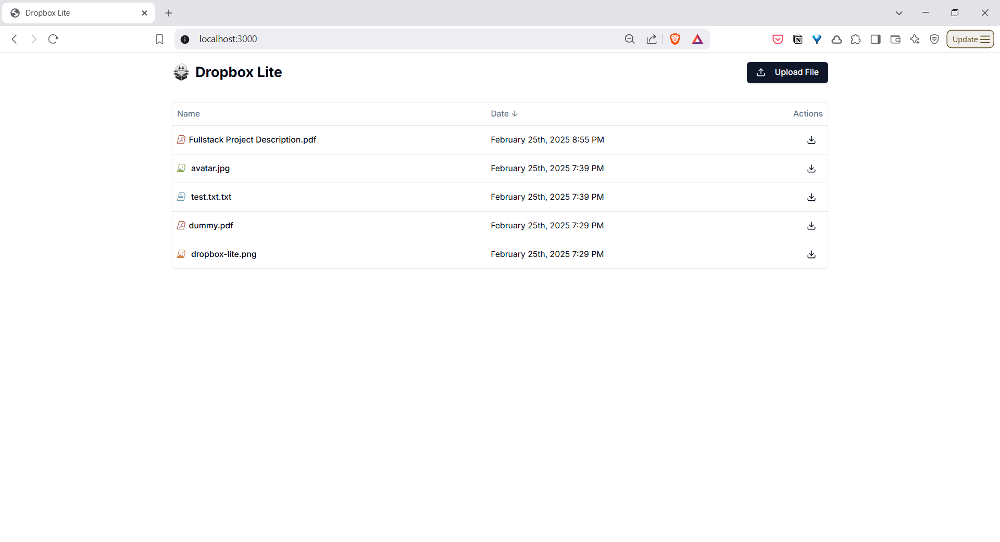
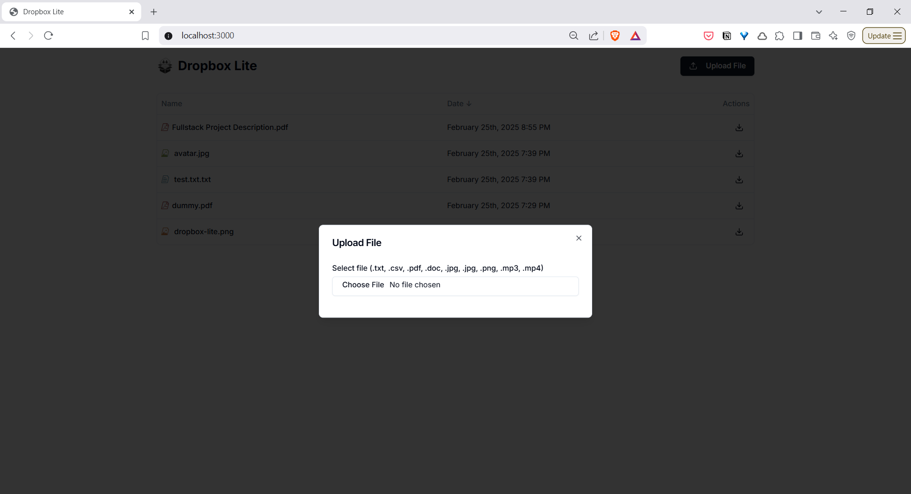

# Dropbox - Lite

Dropbox-Lite is a modern, lightweight file storage and sharing solution that provides an intuitive interface for managing your files in the cloud. Built with a powerful tech stack combining Next.js for the frontend and FastAPI for the backend, this application offers a seamless file management experience.

## Key Features
- **Simple and Modern Interface**: Clean, responsive UI built with Next.js and Tailwind CSS
- **Drag-and-Drop File Upload**: Easy file uploading with support for multiple file types including:
  - Text files
  - Images (JPEG, PNG)
  - PDF documents
  - Microsoft Word documents
  - Audio files (MP3)
  - Video files (MP4)
- **File Management**:
  - List view of all uploaded files
  - Sort files by name or upload date
  - Download files with a single click
  - Real-time upload status and progress indicators
- **Robust Backend**:
  - FastAPI backend for high-performance API operations
  - MinIO object storage for reliable file storage
  - SQLite database for file metadata management
- **Containerized Deployment**:
  - Docker and Docker Compose support for easy deployment
  - Scalable architecture with separate frontend, backend, and storage services

## Media

https://github.com/user-attachments/assets/eadd4939-bbab-45e4-9b6a-960f772894f1

<video width="320" height="240" controls>
  <source src="./media/dropbox_lite_demo.mp4" type="video/mp4">
</video>

### Home Page

### Upload

## Tech Stack
- Next.js
- Tailwind CSS
- Shadcn UI
- Minio Object Storage
- FastAPI
- SQLAlchemy
- SQLite
- Docker
- Docker Compose

## Installation
1. Clone the repository
2. Run `docker compose -f docker-compose.yml up` to start the all instances
3. Run `docker compose -f docker-compose.yml down` to stop the all instances
4. Run `docker compose -f docker-compose.yml up --build` to build and start the all instances
5. Frontend will be available at `http://localhost:3000/`
6. Backend will be available at `http://localhost:8000/`
7. Minio Object Storage will be available at `http://localhost:9001/`
   - Username: `minioadmin`
   - Password: `minioadminpassword`
8. Swagger API Documentation will be available at `http://localhost:8000/docs`

## License
Copyright (c) 2025 Y. Siva Sai Krishna

This project is licensed under the AGPL-3.0 License - see the LICENSE file for details.
